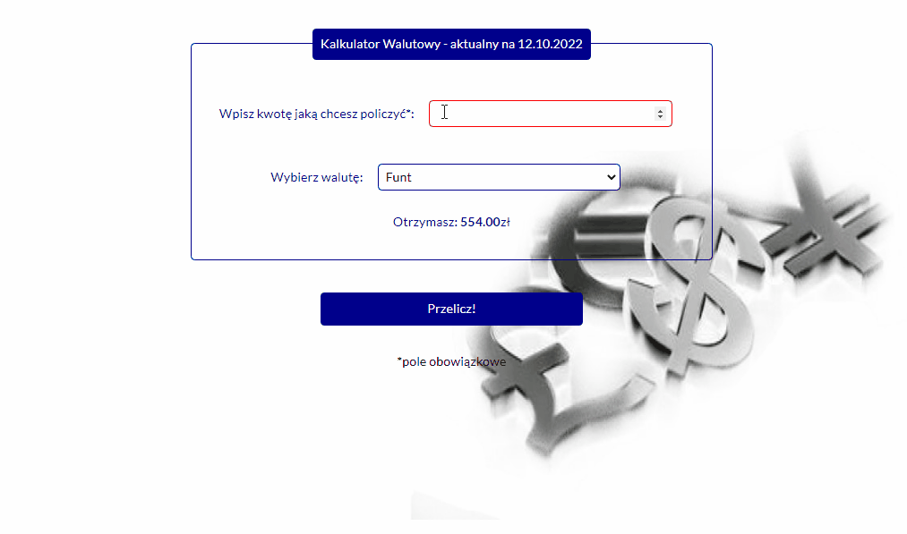

# Currency-conventer

## Table of content
1. Demo
1. Description
1. Preview
1. Technologies

## DEMO
https://adriansacha.github.io/currency-conventer/

## 📒 Description
Simple currency conventer from PLN to GBP and DOL. My first using < form >
# How to use
1. Write amount of PLN in the fied *Wpisz kwotę jaką chcesz otrzymać* you want to exchange
2. Choose currency 
3. Press the button **Przelicz**
5. Then you will see how much money you will get

## 👀 Preview

## 💻 Technologies
* HTML
* CSS
* BEM
* JavaScript
* ES6+ features
* Markdown